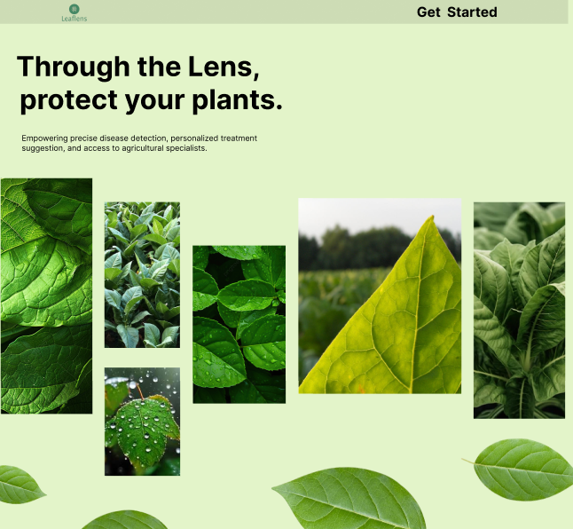

<h2 align="left">🌿 Plant Disease Detection 🌿 AI-Powered Solution for Farmers to Detect Plant Diseases Using Deep Learning</h2>

###

🚀 About the Project Plant disease detection is crucial for farmers to ensure healthy crops. This AI-powered platform uses Convolutional Neural Networks (CNNs) built with PyTorch to classify leaf images into 39 different categories. The model is trained on the PlantVillage dataset.  🔗 Dataset Link: https://data.mendeley.com/datasets/tywbtsjrjv/1

###

<h2 align="left">🛠 How to Run the Project on Your Machine</h2>

###

**Prerequisites** -Python 3.8+ -Install dependencies: pip install -r requirements.txt -Create & Activate a Virtual Environment  **Set Up MongoDB Database:** -Create an account on [MongoDB Atlas] -Replace `MONGO_URI`and `CLIENT_ID` inside the `app.py` file located in the `Flask Deployed App` folder.  **Steps to Run the App:** 1.Navigate to the Flask App Directory(cd Flask_Deployed_App) 2.Download the Pre-Trained Model     📥 Download plant_disease_model_1.pt from https://drive.google.com/file/d/1JIbW29S7292IMd_a16Q2IUj5QNFwjDTx/view?usp=sharing Move the file into Flask_Deployed_App folder. 3.Run the Flask Application : python3 app.py 4.Access the Web App Open your browser and go to: http://127.0.0.1:5000/

###

<h2 align="left">📸 Testing Images</h2>

###

-If you don’t have leaf images, use the sample images in the test_images folder. -Each image is labeled with its corresponding disease name to verify the model's accuracy.

###

<h2 align="left">🖼️ Web App Preview</h2>

    <h2>🏠 Main Page</h2>
      
      
      
      
      
    
   <h2>🔐 Login </h2>
     
   
   <h2>🤖 AI Engine Processing</h2>
      

   <h2>📊 Prediction Results</h2>
      

  <h2>🏪 Supplements/Fertilizer Store</h2>
      
 
  <h2>📞 Contact Us </h2>
    

###

